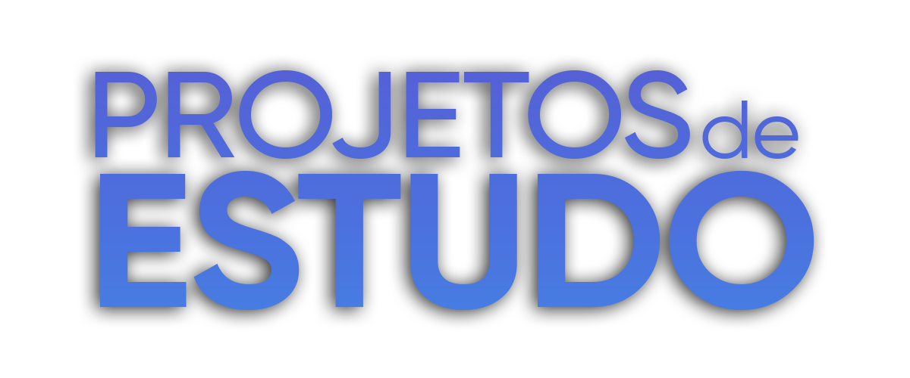

<h1 align="center">
    
    
Minha Jornada de Estudos na   👨‍💻 Área da Programação 💻

</h1>

## 📖 Sobre o Projeto
Aqui vocês podem ver um pouco da minha joirnada de evolução e estudos na programação, projeto do curso da B7Web, projetos da Rocketseat, entre outros...

## 🔨 Tecnologias Utilizadas
- HTML
- CSS
- Javascript
- React

## 🧱 Como Contribuir para o Projeto
Bom como é um projeto de estudos não tem muito o que contribuir, mas sim ajudar e dar dicas do que posso fazer para treinar, eu tenho um servidor no discord --> [Clique Aqui para Entrar](https://discord.gg/2mRhtFJkJN) <-- lá tem áreas de diversos assuntos e um é o de programação, podemos trocar ideias e conhecimento por lá!
